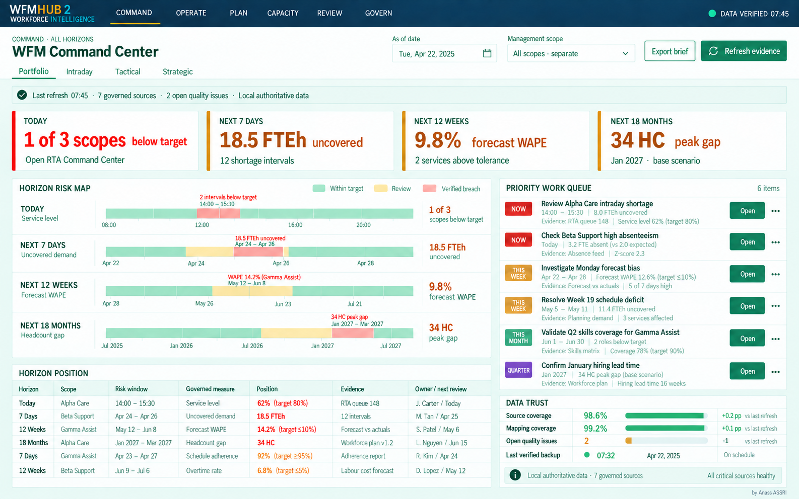
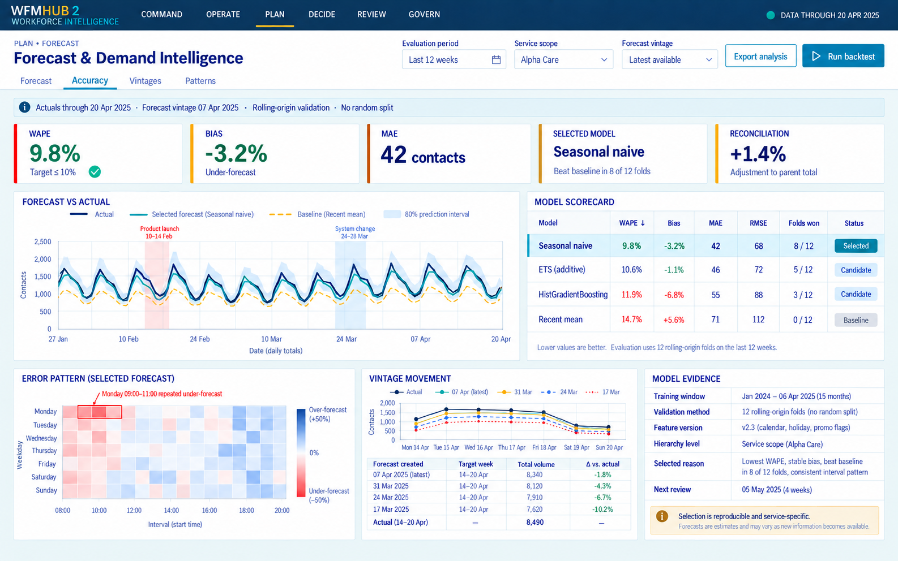
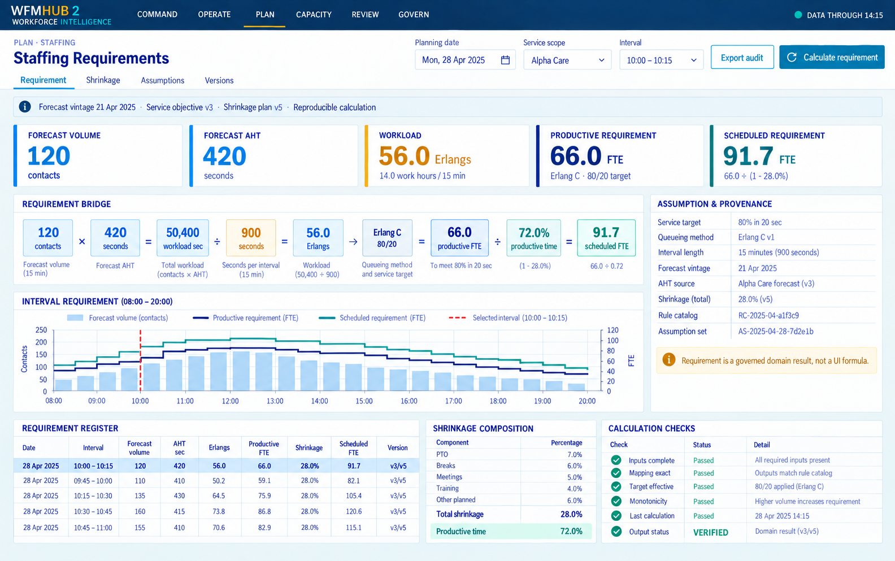
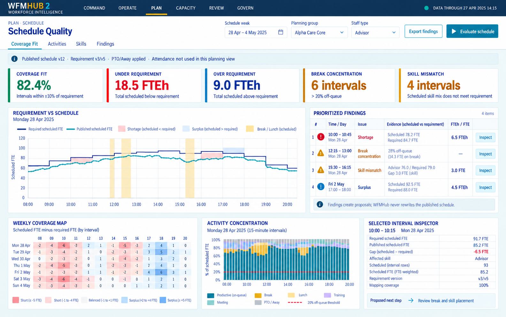
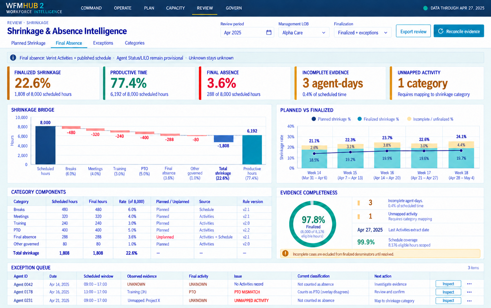
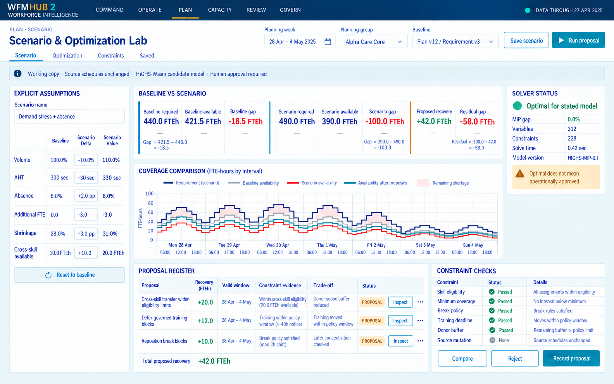
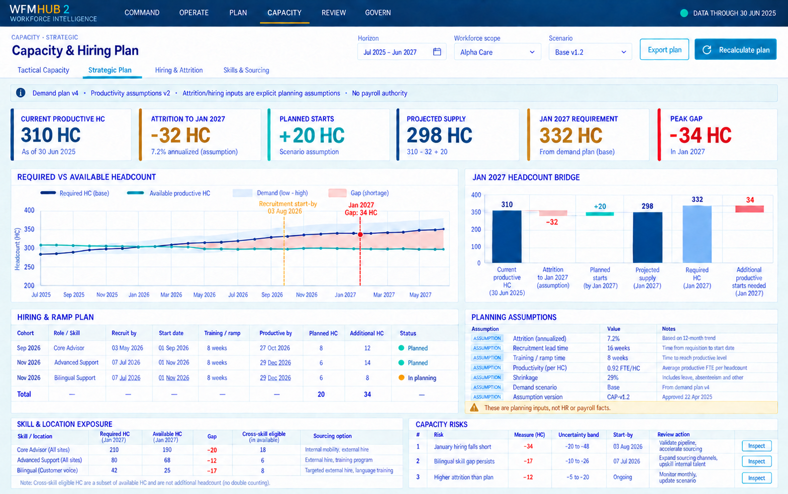
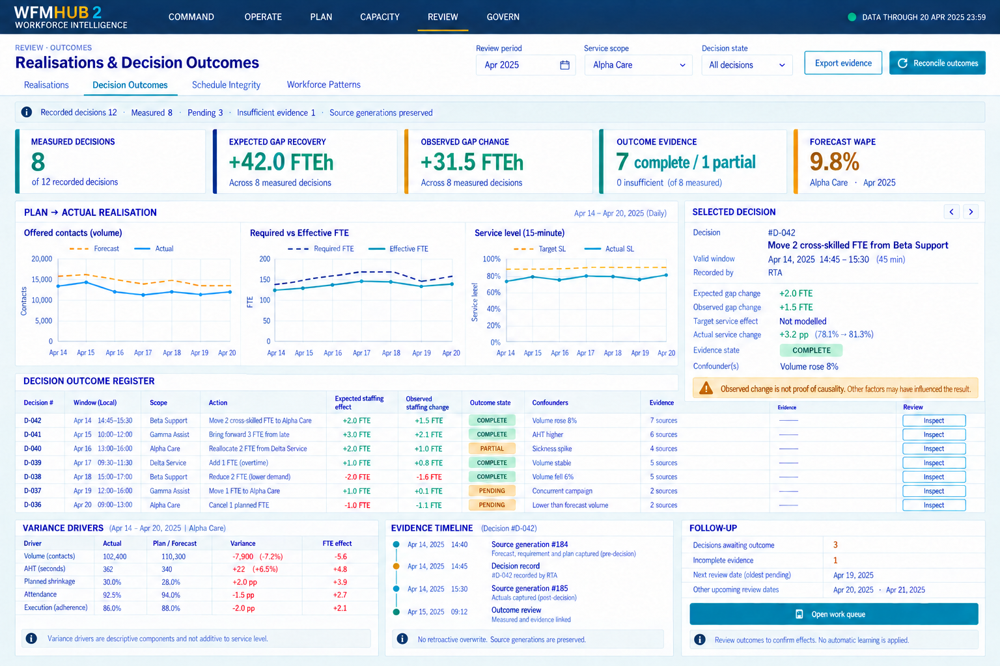
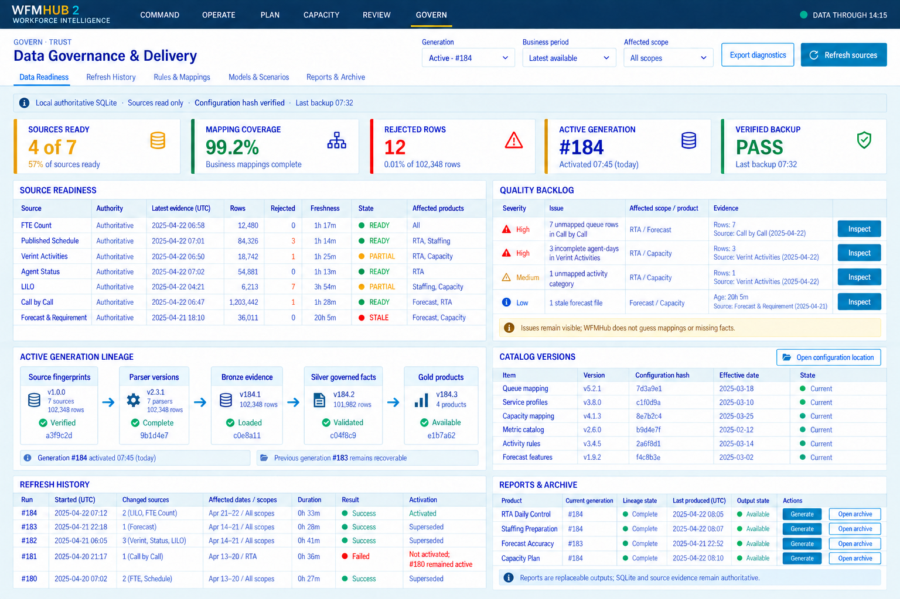

# WFMHub 2 full-product UI architecture

Status: approved product-wide design baseline; business capabilities remain staged. This document extends the
Phase 1 [RTA blueprint](UI_BLUEPRINT.md) to tactical and strategic WFM. The
mockups are design references, not evidence that their business engines exist.

## One product, several horizons

WFMHub follows one governed decision loop across different time scales:

```text
Evidence -> Explain -> Plan/compare -> Human decision -> Measure outcome
    |         |              |                 |                 |
  sources   RTA/review    forecast/scenario   register         learning
```

The old WFMHub-Portable navy/teal/gold identity is retained, with the report
workbook's green `#1F7A53` and pale green `#DDF3E8` replacing bright-blue
information accents. The product shell credits **by Anass ASSRI**. The full shell
has six workspaces, the maximum we will expose in the primary navigation at
the 1280 px minimum working width:

| Workspace | Purpose | Pages and local tabs |
| --- | --- | --- |
| **Command** | Rank work and decisions across horizons | Cross-horizon Workbench; Decision Inbox/Register |
| **Operate** | Manage today's service and people evidence | RTA Command Center; Live Service; Staffing & Coverage; Attendance; Intraday Risk & Actions |
| **Plan** | Improve demand, staffing, schedules, and scenarios | Forecast & Demand; Staffing Requirements; Schedule Quality; Shrinkage Plan; Scenario & Optimization Lab |
| **Capacity** | Translate workload into weeks, months, skills, and hiring | Tactical Capacity; Strategic Workforce Plan; Hiring & Attrition; Skills & Sourcing |
| **Review** | Reconcile later actuals and outcomes | Realisations; Forecast Accuracy; Decision Outcomes; Schedule Integrity; Final Absence & Shrinkage; Workforce Patterns |
| **Govern** | Keep results reproducible and deliverable | Data Readiness; Refresh History; Mappings & Rules; Model/Scenario Registry; Reports & Archive |

Decisions occur in every workspace; `Decide` is not a seventh navigation item.
The action composer appears in context and writes to one consolidated decision
register under Command. Optimization belongs in the Scenario Lab as a method,
not as a separate business horizon. Reports remain available through a header
action and the Govern workspace, not a separate `Deliver` area.

Only functional pages appear in navigation. A full route and domain skeleton
may exist internally, but an unreleased page must not appear as a dead tab.
Local tab rows expose at most five items; lower-frequency products go in a
`More` menu. Global scope controls vary by workspace rather than showing
disabled filters irrelevant to the current question.

## Full-product shell

```text
┌─────────────────────────────────────────────────────────────────────────────┐
│ WFMHUB 2    COMMAND  OPERATE  PLAN  CAPACITY  REVIEW  GOVERN   DATA VERIFIED│
├─────────────────────────────────────────────────────────────────────────────┤
│ Horizon + page title | local tabs | scoped filters | Export | Refresh/Run    │
├─────────────────────────────────────────────────────────────────────────────┤
│ source cuts · generation · model/rule versions · uncertainty · quality      │
├─────────────────────────────────────────────────────────────────────────────┤
│ work surface: overview -> inspect evidence -> propose -> record -> review   │
└─────────────────────────────────────────────────────────────────────────────┘
```

The shell keeps the old compact navy header, gold active rule, teal primary
action, green information accents, cool-gray canvas, white panels, dense
tables, and tabular numerals.
The shared token and accessibility contract remains in
[UI_BLUEPRINT.md](UI_BLUEPRINT.md#visual-system-inherited-from-wfmhub-portable).

Use `As of` dates for Command, business date/service scope for Operate,
forecast vintage/planning group/horizon for Plan, month/skill/location for
Capacity, finalized period/source generation for Review, and generation/rule
version for Govern. Every workspace shows its own evidence cut and assumptions.

## Visual pack

### 1. Cross-horizon Command

The home page presents four separate horizon positions—today, next seven
days, next twelve weeks, and next eighteen months—without adding unlike
measures. A horizon risk map, prioritized work queue, exact-measure register,
and data-trust panel lead to the relevant working page.



### 2. Forecast & Demand Intelligence

Selected forecast versus actual, a baseline comparator, rolling-origin model
scorecard, weekday/interval error pattern, forecast-vintage movement, and
reproducible model evidence. WAPE, bias, MAE, and RMSE retain their separate
meaning. A more complex model is only selected after beating the baseline.



### 3. Staffing Requirements

A traceable bridge from forecast volume and AHT to workload, productive FTE,
and scheduled FTE after shrinkage. The interval register and provenance panel
show forecast vintage, service objective, queueing method, assumptions, and
rule versions. Contacts, Erlangs, FTE, FTE-hours, and HC are never conflated.



### 4. Schedule Quality

Requirement versus published schedule by interval, a weekly signed-coverage
heatmap, activity concentration, skill mismatch, and inspectable findings.
Daily totals cannot conceal a bad 15-minute fit. This is planned coverage,
not observed attendance, and proposals never edit the source schedule.



### 5. Shrinkage & Absence Intelligence

Planned and finalized components, a reconciled shrinkage bridge, evidence
completeness, and a residual exception queue. Agent Status/LILO support
same-day provisional attendance; finalized absence uses Verint Activities,
published schedule overlap, effective rules, and PTO/Away overlays. Unknown
or unmapped evidence is excluded from finalized measures until resolved.



### 6. Scenario & Optimization Lab

An explicit working-copy baseline and deltas, scenario gap, bounded recovery
proposals, model/constraint status, trade-offs, and a human decision handoff.
`Optimal` means optimal for the stated formulation, not operational approval.
HiGHS-Wasm may generate proposals; source schedules remain unchanged. No
service-level lift is claimed before a separate impact model is qualified.



### 7. Capacity & Hiring Plan

Tactical and strategic capacity share a demand/supply bridge, but month-level
hiring and attrition assumptions are explicit and versioned. The headcount
bridge separates current HC, attrition, planned productive starts, additional
starts needed, recruitment lead time, and ramp. Cross-skilled staff are a
subset of available supply, not extra people.



### 8. Realisations & Decision Outcomes

Post-day forecast/actual, staffing, and service comparisons retain their
natural grains. The decision register preserves the original baseline,
expected staffing effect, later observation, evidence generations, and
confounders. Observed improvement is not automatically attributed to the
recorded action.



### 9. Data Governance & Delivery

Source readiness, quality backlog, active generation lineage, effective
catalog versions, refresh history, and reports/archive share one trust
surface. Browser mapping views are read-only initially. Failed refreshes do
not activate a partial generation; reports are replaceable outputs, while
SQLite and source evidence remain authoritative.



## Page contracts beyond the nine visual anchors

The images are anchors, not the whole route list. These pages share the same
shell, evidence strip, panel language, and typed domain contracts.

| Page | Must answer | Evidence and safe action |
| --- | --- | --- |
| Tactical Capacity | Where are the next 1–12 week FTE-hour gaps? | Forecast, requirement, published supply, PTO/training and known changes; compare options and record a decision. |
| Shrinkage Plan | Which future activities reduce scheduled productive time? | Final historical categories plus future approved/scheduled activities; test explicit assumptions, not final absence claims. |
| Hiring & Attrition | When must recruitment begin to close a future HC gap? | Effective-dated roster, attrition, lead/ramp and HC-to-FTE conversion assumptions; propose, never write HR records. |
| Skills & Sourcing | Which skill or location is short, and what can transfer? | Eligibility, donor buffer, costs, workforce ownership and mutually exclusive capacity; compare insource/outsource options. |
| Schedule Integrity | Which exact schedule/observed fragments remain unexplained? | Agent Status primary, LILO fallback, finalized Activities; read-only residual review and export. |
| Workforce Patterns | Is a repeated finding supported by enough eligible evidence? | Recurrence rules, eligible days and quality; inspect and export for human review, no employee score. |
| Decision Register | What was known and chosen, and did it work? | Baseline generation, candidate, assumptions, constraints, reason, owner, outcome window and later actuals. |
| Model/Scenario Registry | Can a result be reproduced? | Model/features, training/validation windows, metrics, scenario inputs, solver status and versions. |
| Reports & Archive | Which governed output is current? | Generation, lineage, timestamp, product catalog and archived copy; generate/download locally. |

Useful old-product adjacencies are retained without shaping the main WFM
navigation: PCS Performance/Coaching and controlled Bonus Management are
optional Review/Govern modules. They need their own legacy-parity and data
handling gates before appearing in the new product.

## Capability honesty

| Capability | Current evidence | UI rule |
| --- | --- | --- |
| Portable shell, SQLite, Edge Workers, WASM | Exact Phase 0.4 doctor/browser compatibility passed on the target | Platform may support these screens; it does not prove their WFM logic exists. |
| Old-product parity: service, attendance, schedule review, staffing preparation, final absence/shrinkage, reports, mappings | Governed contracts and implementations exist in WFMHub-Portable | Port selectively with synthetic tests and exact business validation. |
| Forecast vintages and rolling-origin model selection | Architecture and compatibility model fits exist, not production backtests | Mark as planned until canonical vintages and evaluation pass. |
| Independent staffing requirement | Domain objective exists; independent formula/model not yet accepted | Do not treat visual numbers as calculation authority. |
| Schedule-quality score and scenario optimizer | UI concepts and small HiGHS-Wasm compatibility MIP exist | No operational recommendation until model, constraints, scale and invariants pass. |
| Hiring, attrition, ramp, cost and sourcing | No governed operational source contract yet | Label all inputs as assumptions and avoid HR/payroll authority claims. |
| Decision learning and causal effect | Decision/outcome architecture exists, no validated causal model | Report observed outcomes and confounders, not causal attribution. |

Generated images use synthetic values and can contain illustrative rounding or
layout shorthand. They are not a source of KPI definitions, evidence
classifications, formulas, or release acceptance. Code and reports must use
the effective domain/catalog contracts and pass numeric reconciliation tests.

## Component and route skeleton

```text
web/src/
  app/                 six-workspace shell, nav, route metadata, capability flags
  design/              shared tokens, tables, panels, charts, status and focus
  contracts/           typed host DTOs, source cuts, versions, uncertainty
  features/
    command/           cross-horizon queue and decision register
    operate/           service, staffing, attendance, intraday action
    plan/              forecast, requirement, schedule, shrinkage, scenario
    capacity/          tactical, strategic, hiring, skills and sourcing
    review/            realisations, accuracy, outcomes, integrity, absence
    govern/            readiness, refresh, catalogs, registry, reports
  lib/                 local API, routing, dates, formatting only
```

Common components include `EvidenceStrip`, `SourceCutBadge`,
`MetricCard`, `IntervalChart`, `ForecastVintageSelector`,
`RequirementBridge`, `CoverageHeatmap`, `StaffingLadder`,
`AssumptionPanel`, `ScenarioComparison`, `ConstraintInspector`,
`DecisionComposer`, `OutcomeTimeline`, `QualityBacklog`, and
`GenerationLineage`. No component calculates a business KPI or silently
converts null/unknown to zero.

## Delivery sequence

1. Keep the **full six-workspace shell** and typed route/capability metadata
   from the start; initially expose only working RTA and governance pages.
2. Port old governed source contracts, migrations, formulas, mappings,
   parity tests and outputs; complete the RTA vertical slice.
3. Add forecast/requirement data contracts and real rolling-origin evaluation;
   then build Forecast, Staffing Requirements and Schedule Quality.
4. Add finalized shrinkage/realisations and decision/outcome persistence;
   measure old-product parity before claiming replacement.
5. Add scenario/optimization only after domain invariants, solver formulation,
   target-scale performance and human-review workflow pass.
6. Add tactical and strategic capacity after governed hiring/attrition/ramp,
   productivity, skill, cost and sourcing assumptions exist.
7. Expose optional PCS/Bonus products only after their own controlled parity
   and privacy review.

At every step, production UI acceptance requires accessible keyboard/table
interaction, legible dense text, loading/empty/stale/partial-evidence states,
realistic synthetic tests, exact extracted-ZIP operation on the target, and
no source-file mutation or runtime upload path.
