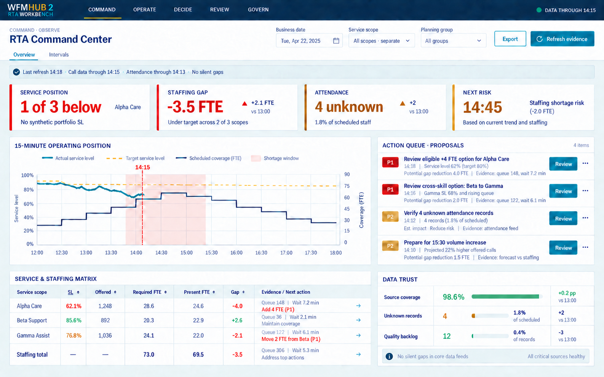
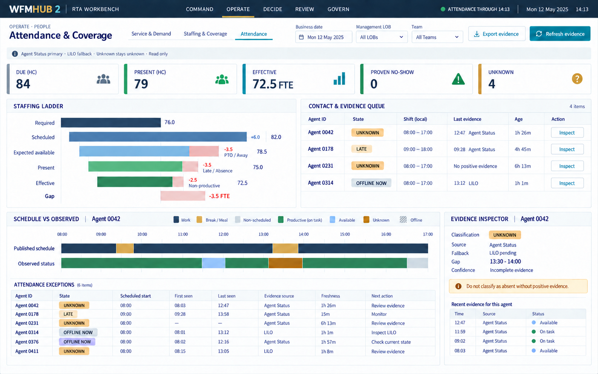
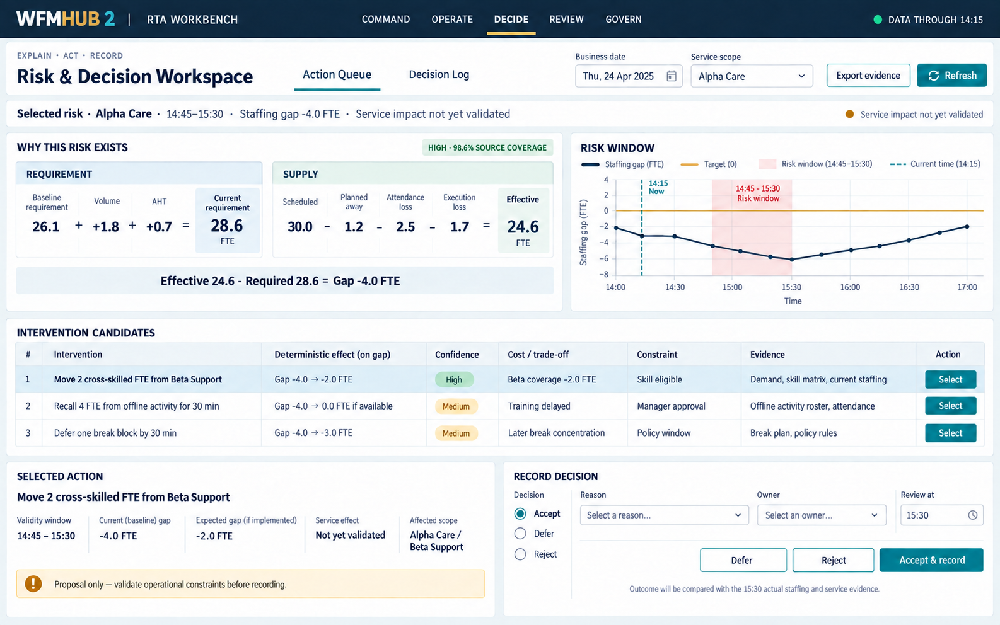

# WFMHub 2 UI blueprint

Status: Phase 1 RTA screen study. The six-workspace shell and full product
hierarchy in [FULL_PRODUCT_UI.md](FULL_PRODUCT_UI.md) supersede this document's
earlier five-item navigation and route sketch. The three RTA screen concepts
and shared visual tokens remain valid.

## Design outcome

WFMHub 2 will evolve the proven WFMHub-Portable interface rather than replace
it with an unrelated dashboard aesthetic. It keeps the old product's compact
navy, teal, gold, white, and cool-gray operational language while improving
readability and centring the workflow on:

```text
Observe -> Explain -> Act -> Record -> Measure
```

The Phase 0.4 dark/cyan compatibility screen remains a diagnostic page. It is
not the visual baseline for the WFM product.

## Product constraints

- Desktop is primary; 1280 px is the minimum supported working width.
- The product is single-user, local, and offline-capable.
- The UI reads configured source folders through the local host. It never asks
  the user to upload workforce files.
- Unknown evidence remains visibly unknown.
- Red means a verified operational breach, never decoration.
- Every recommendation shows evidence, impact, confidence, constraints, and
  operational cost before it can be recorded as a decision.
- React renders governed results. KPI formulas do not live in components.

## Phase 1 screen subset

Only working capabilities appear in navigation. Workspaces and pages are
enabled progressively as their governed contracts become functional; the
shell must not ship dead pages. The full product has six workspaces, with
Plan and Capacity present in route metadata but hidden until useful pages
work. The table below records the original RTA study's page grouping; use
the full-product route placement when implementing.

| Workspace | Pages | Primary question |
| --- | --- | --- |
| Command | Cross-horizon Workbench; Decision Register | What needs attention at each horizon, and what was chosen? |
| Operate | Service & Demand; Staffing & Coverage; Attendance | What is happening in service and people? |
| Plan | Forecast, requirements, schedule, shrinkage and scenarios | What should be planned or compared? |
| Capacity | Tactical and strategic workforce plans | How much supply is needed, where and when? |
| Review | Schedule Integrity; Outcome Review | What remained unresolved and did the action work? |
| Govern | Data Readiness; Refresh History; Reports | Can the evidence be trusted and reproduced? |

The RTA Command Center itself lives under Operate; the cross-horizon Command
page links to it. Intraday action proposals remain contextual in Operate;
recorded decisions aggregate in Command and measured outcomes in Review.

## Global shell

```text
┌─────────────────────────────────────────────────────────────────────────────┐
│ WFMHUB 2 | COMMAND OPERATE PLAN CAPACITY REVIEW GOVERN   DATA THROUGH 14:15│
├─────────────────────────────────────────────────────────────────────────────┤
│ Kicker + page title | local tabs | global scope | Export | Refresh evidence │
├─────────────────────────────────────────────────────────────────────────────┤
│ freshness · source coverage · unresolved evidence · active governed scope    │
├─────────────────────────────────────────────────────────────────────────────┤
│                                                                             │
│                         active workspace                                    │
│                                                                             │
└─────────────────────────────────────────────────────────────────────────────┘
```

Global controls are limited to business date, service scope, and planning
scope when applicable. Team, agent, interval, and other contextual controls
belong inside the relevant workspace. Disabled irrelevant filters are not
displayed.

The persistent evidence strip states what was refreshed, the latest business
cut per source, and whether incomplete evidence affects the current result.

## Priority screen 1 — RTA Command Center

Purpose: produce one reliable operating picture and a ranked next-action list.

1. Four decision cards: Service Position, Staffing Gap, Attendance, Next Risk.
   Multi-scope service is a count of separate positions, never a synthetic
   portfolio service level.
2. Main 15-minute operating position: actual service, configured target,
   coverage, current-time marker, and future shortage windows.
3. Action queue: priority, deadline, reason, expected impact, evidence, and a
   route to inspect rather than an automatic action.
4. Service and staffing matrix: separate governed scopes with raw components.
5. Data-trust panel: source coverage, unknown records, and quality backlog.



## Priority screen 2 — Attendance & Coverage

Purpose: separate staffing loss from evidence uncertainty and make follow-up
fast without misclassifying missing data as absence.

1. Headline states: Due, Present, Effective, Proven No-show, Unknown.
2. Staffing ladder: Required -> Scheduled -> Expected available -> Present ->
   Effective -> Gap.
3. Contact/evidence queue with anonymous identifier, shift, last evidence,
   evidence age, classification, and next action.
4. Published-schedule versus observed-status timeline.
5. Read-only evidence inspector with source, fallback, exact gap, freshness,
   and confidence.



## Priority screen 3 — Risk & Decision Workspace

Purpose: make WFMHub 2 a decision tool rather than another passive dashboard.

1. Selected risk and exact validity window.
2. Two reconciled deterministic bridges before any predictive explanation:
   baseline drivers to current requirement, then scheduled staffing losses to
   effective staffing and the final gap.
3. Risk-window chart showing baseline, target, and exposure.
4. Intervention candidates with deterministic gap effect, confidence,
   constraints, evidence, and cost/trade-off shown separately. Projected
   service impact remains explicitly unvalidated until a qualified model exists.
5. Explicit Accept, Defer, or Reject decision record.
6. Outcome review time so the later actual can be compared with the baseline
   and expected effect.



## Visual system inherited from WFMHub-Portable

| Token | Value | Use |
| --- | --- | --- |
| Navy | `#0B1F33` | shell, structure, strong text |
| Navy secondary | `#173750` | active shell surface |
| Teal | `#007C83` | active state and primary operational action |
| Gold | `#D6A84B` | target, controlled emphasis, active shell rule |
| Canvas | `#F4F7F9` | working background |
| Ink | `#1F2933` | body text |
| Muted | `#536474` | secondary evidence text |
| Line | `#D8E0E6` | panel, table, and control borders |
| Green | `#1F7A53` / `#DDF3E8` | healthy or proven-ready state |
| Amber | `#A65F00` / `#FFF1CC` | incomplete evidence or review required |
| Red | `#B42318` / `#FDE7E5` | verified risk or breach |
| Blue | `#0563C1` / `#E3F0FA` | neutral information |
| Purple | `#6E56CF` / `#EEEAFE` | planned leave or governed activity |
| Future | `#9AA6B2` / `#EEF1F4` | future or not-yet-observed interval |

Titles use Aptos Display when available; body and tabular data use Aptos with
Segoe UI and system sans-serif fallbacks. Operational numbers use tabular
figures.

Readability deliberately improves on the old browser UI:

- body and table text: 13–14 px;
- secondary text: minimum 12 px;
- uppercase labels: minimum 11 px;
- buttons: minimum 34 px high;
- table rows: 40–44 px;
- panels: 4 px radius and thin borders, without oversized cards;
- 8 px spacing scale with 24 px desktop page gutters.

## Core components

- `AppShell`: product identity, primary workspace navigation, data-cut state;
- `WorkspaceHeader`: kicker, title, local tabs, scoped controls and actions;
- `EvidenceStrip`: freshness, coverage, unknowns and source authority;
- `MetricCard`: value, target/delta, evidence meaning and semantic state;
- `Panel`: title, description, evidence tag and scoped actions;
- `IntervalChart`: 15-minute position, target and current-time marker;
- `StaffingLadder`: explicit required-to-effective loss decomposition;
- `ActionQueue`: ranked, inspectable proposals or evidence tasks;
- `EvidenceTable`: virtualized dense table with frozen headers;
- `AgentTimeline`: schedule and observed evidence on one time axis;
- `EvidenceInspector`: provenance, freshness, uncertainty and definitions;
- `DecisionComposer`: candidate, trade-off, decision, reason and review time;
- `EmptyState` / `ErrorState`: explain missing evidence and the safe next step.

## Presentation boundaries

- Components receive domain-produced values and semantic statuses. They do not
  infer that a generic percentage is good or bad.
- Service and staffing scopes are not combined into a synthetic portfolio KPI.
- Charts must expose their source cut and raw components through a table or
  inspector.
- Color is never the only signal; use text, shape, label, and icon together.
- Keyboard focus, semantic tables, labelled controls, reduced motion, and at
  least WCAG AA contrast are implementation gates.
- Suggested actions never alter schedules, activities, or source files.

## Original RTA React skeleton

This sketch is retained for the Phase 1 component study. Use the full-product
feature folders in [FULL_PRODUCT_UI.md](FULL_PRODUCT_UI.md#component-and-route-skeleton)
for implementation.

```text
web/src/
  app/
    AppShell.tsx
    navigation.ts
    routes.tsx
  design/
    tokens.css
    components/
  features/
    command/
    operate/service/
    operate/staffing/
    operate/attendance/
    decide/actions/
    decide/log/
    review/integrity/
    review/outcomes/
    govern/readiness/
    govern/refresh/
    govern/reports/
  contracts/
  lib/
```

Feature modules may import the shared design system and typed API contracts;
they must not import one another's internal components or reproduce business
formulas.

## Implementation order

1. Install the shared tokens, shell, navigation, responsive grid, semantic
   states, and accessibility baseline.
2. Define typed synthetic contracts for freshness, service, staffing,
   attendance, actions, and decisions.
3. Build the Command Center with synthetic data and interaction tests.
4. Connect the first governed host contracts and preserve loading, empty,
   partial-evidence, stale, and failure states.
5. Build Attendance & Coverage, including the schedule/observed inspector.
6. Build the deterministic risk explanation and decision record.
7. Add schedule integrity, outcome review, readiness, refresh history, and
   report delivery until useful old-product parity is reached.
8. Add Plan and optional browser-WASM enhancements only after measured value
   and production-scale qualification.

The mockups are visual direction, not formula or data-contract authority. All
displayed names and values are synthetic.
